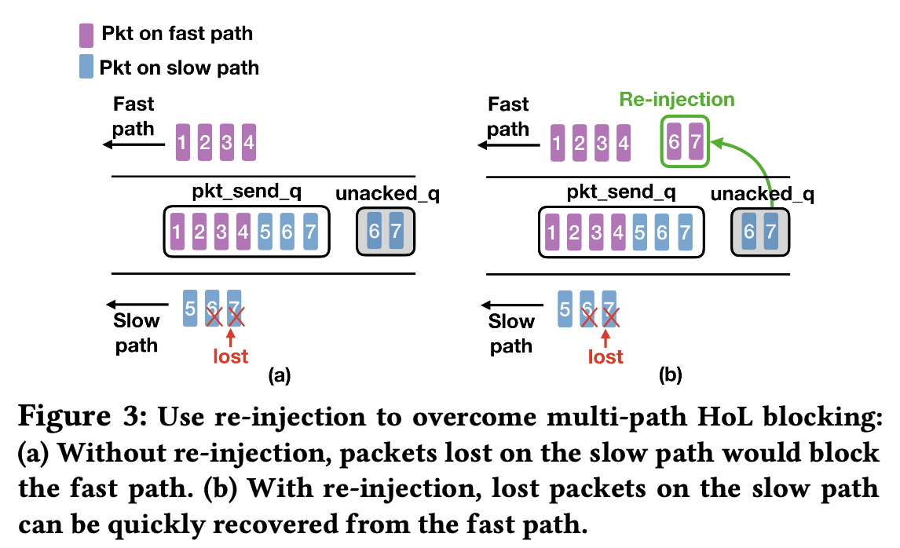

https://dl.acm.org/doi/abs/10.1145/3452296.3472893

## 简介

这是一篇阿里的工业届文章，主要介绍在淘宝短视频传输中部署multi-path QUIC的经验。

## 背景和动机

### 电子商务对视频传输的需求

- 视频传输是电子商务的一个重要部分，可以帮助用户进行商品选择
- 视频卡顿、启动延时会影响用户体验（要求低延时）；用户希望看到商品高清晰度的展示（要求高吞吐）

### multi-path和QUIC

对移动设备来说，可以通过聚合Wi-Fi和4G/5G的带宽来满足高带宽要求，因此multi-path看起来是一个可行的解决方案。MPTCP协议虽然比较成熟，但需要系统级的支持，实际部署的开销会很大。QUIC作为用户空间协议，迭代的代价更低、周期更短。对于QUIC中使用multi-path，已经有工作提出了一些方案，但可能并不适用于短视频传输场景，并且没有在真实环境中测试过。

### 移动性支持

漫游切换是无线通信中的一个难题，QUIC中的connection migration（CM）机制来解决这一问题，但这一过程会重置拥塞窗口，无法保证持续高带宽。Siri使用MPTCP支持Wi-Fi到LTE漫游，在视频传输中也值得尝试和实验。

5G相对于4G的新特性也会在与Wi-Fi同时存在时产生新的效应。

## 主要设计

设计的主要目标是提高QoE的同时尽可能地减小overhead。XLINK相比已有multi-path（MPTCP、MPQUIC）的主要优势在于利用了应用层提供的信息。

XLINK整体实现为一个QUIC的拓展，用户端向服务器传递QoE信息，服务器根据该信息来进行muilti-path的调度和管理。

XLINK主要包含三个部分：

- priority-based re-injection，主要解决multi-path head-of-line blocking（HoL）、stream blocking和start-up delay
- QoE feedback，主要控制re-injection的冗余程度，减小开销
- path management，主要负责无线路径的选择（Wi-Fi、LTE、5G）

### priority-based re-injection

HoL简单来说就是本应先到的数据如果没到，那么后面的数据即使到了也会被阻塞，需要等待前面数据的重传。关于HoL的介绍：https://zhuanlan.zhihu.com/p/330300133。

#### HoL blocking

multi-path中可能出现HoL的主要原因：path性能不同，存在快慢。如果一个chunk有从快路径走的也有从慢路径走的，那么如果慢路径上丢包，后续的chunk必须等待丢失包重传。re-injection会在发送队列为空时检查未确认队列，将未确认的包重新注入快路径发送，比重传机制反应更快。示意图如下：

#### stream blocking

普通的re-injection只适用于TCP。在QUIC中有stream的概念，每个steam有单独的流控制和错误恢复。视频传输中，客户端可能同时请求多个流。假设发送队列中有2个流，当流1发送完成后进行re-injection，按传统方法注入的包会排在流2之后，这样的话流2还是会被阻塞（下图a）。因此采用priority-based的方法，按流区分包的优先级，re-injection时会将包排在优先级低于它的所有包之前（下图b）。

#### first-frame acceleration

视频首帧的传输更为重要，而帧的粒度比流更细，所以需要更细粒度的优先级管理，对首帧的re-injection赋予更高的优先级。传输时会指定流中包含首帧数据的部分为最高优先级，re-injection时特殊处理（下图c）。

### QoE feedback & re-injection control

直接使用re-injection会增加大约15%的流量，这对于大规模部署来说是不可接受的。XLINK通过利用用户端QoE信息来调整是否进行re-injection，例如用户端缓冲区较为充裕，则可以不启用re-injection来减小开销。所用到的QoE信息：cached bytes / bps，cached frames / fps，分别可以用这两组数据来计算还有多长时间的视频可以缓冲播放（剩余时长）。

使用双阈值控制是否进行re-injection：Th1<Th2。由QoE信息计算出剩余时长后，如果小于Th1，说明缓冲水平低，立即启用re-injection；如果大于Th2，说明缓冲水平高，立即停止re-injection。如果在两者之间，则考察所有path中最大的剩余传输时长（该path的最大RTT+方差），如果剩余传输时长大于剩余缓冲时长，说明来不及完成传输，则启用re-injection，反之亦然。

调整Th1和Th2可以调节overhead。

### Qoe-aware path management

路径管理包括主要路径的选择（primary path selection）和ACK路径选择（ACK path selection）。

#### primary path selection

实验表明主路径的选择对视频首帧延迟有很大影响（不同类型网络性能不同），因此可以指定优先级5G SA > 5G NSA > Wi-Fi > LTE。但这一顺序可能在不同的国家和地区有所差异。（补充：5G SA指独立组网StandAlone，与5G NSA相比不再使用和4G共享的核心网络，并且支持边缘计算，将内容分发带向网络边缘）

#### ACK path selection

不再限制ACK按原路径返回，而是可以从最快的路径返回。更快速的ACK可以使得拥塞窗口增长更快，提高吞吐。

## 实验结果

在线实验部分将XLINK部署到淘宝APP，共有100K测试参与者，3M个短视频播放。另外还有可控实验部分来检验移动性和能耗。实验中CC使用Cubic，multi-path使用decoupled模式。

### Vanilla-MP vs. SP（single-path）

Vanilla-MP是已有的multi-path QUIC的实现。其性能尚不及single-path QUIC，原因主要在于无线网络的变化很快，且不同类型网络的差异很大。

### double threshold

选取不同的Th1和Th2考察buffer length：

- re-injection有用，不启用时性能较差
- QoE有用，不启用时额外开销很高（15%）
- 选取较小的阈值区间即可（80-95），区间再大性价比不高

### XINK vs. SP（single-path）

RCT在50、95、99分位上均有提升。

rebuffer rate也有显著提升。

单独考察首帧加速功能，不采用时首帧延迟高于SP，在快慢路径差异大时更加明显。采用后有明显提升。

### mobility

使用地铁和高铁上的trace来进行Mahimahi仿真。分别考察SP（single path）、Vanilla-MP（QUIC multi-path）、MPTCP、XLINK、CM（QUIC with connection migration）。

SP没有移动性支持，表现差；CM在旧路径恶化时可以建立新路径，但有时新路径也可能很快恶化，并且建立新路径后拥塞窗口重置，因此有时优于SP，有时不如；MPTCP和Vanilla-MP好于前两者，但由于没有针对短视频的优化，效果不如XLINK。

### energy consumption

多路径的energy per bit要好于蜂窝网络LTE（4G）和NR（5G），Wi-Fi固然省电但throughput差很多，因此存在trade-off。

## 一些想法

- 传输层利用应用层信息确实是相当常见的思路，QUIC有很多值得挖掘的地方
- 整体的设计还是比较简单易懂的，找到问题的根源在哪，解决了即可
- 能够在真实生产环境部署实验实属不易，结果却是更让人信服
